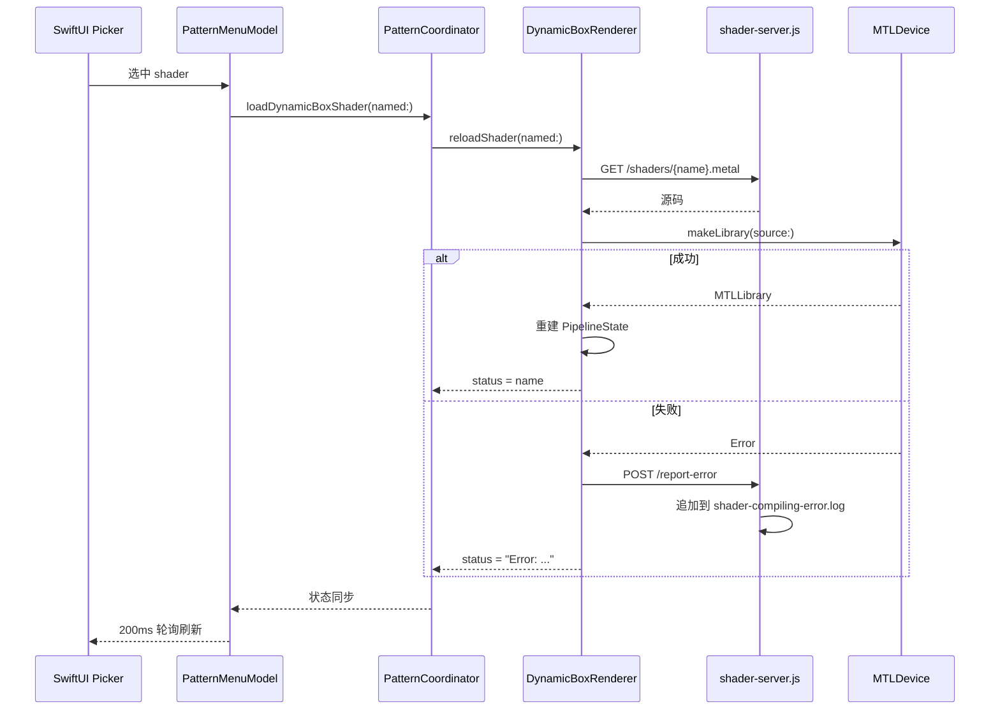

# DynamicBox — 动态着色器使用规范

## 目录结构

```
vr-dive/Demos/DynamicBox/
├── DynamicBoxRenderer.swift      # 渲染器（热加载逻辑）
├── DynamicBoxShaders.metal       # 内嵌默认着色器（编译进 app）
├── DynamicBoxTypes.swift         # Uniforms 结构体
├── shader-server.js              # Node.js 后端服务
├── shaders/                      # 可动态加载的 .metal 着色器
│   ├── inversion-menger.metal    # 球面反演 + Menger 折叠发光图案
│   ├── subdivided-cubes.metal    # 随机递归细分立方体发光图案
│   ├── cosine-cross-orbit.metal  # 余弦扰动与叉积轨道发光图案
│   ├── dispersive-gem.metal      # 光谱色散折射宝石图案
│   ├── holofoil-dice.metal       # Holofoil Dice 全息骰子图案
│   ├── space-station-bokeh.metal # Space Station 单 pass Bokeh 图案
│   ├── quasicrystal-filigree.metal # 二十面体准晶花丝图案
│   ├── voronoi-cellular-foam.metal # 三维 Voronoi 晶胞泡沫图案
│   ├── coxeter-rose-window.metal # Coxeter 多层立体花窗图案
│   ├── galaxy.metal              # Worley + FBM 旋臂星系图案
│   ├── warped-mushroom.metal     # Warped sphere 蘑菇形体图案
│   ├── waves.metal               # 示例：彩色波形干涉
│   └── sdf-shapes.metal          # 示例：复杂 SDF 几何体
├── server.log                    # 服务运行日志（已 gitignore）
├── shader-compiling-error.log    # Metal 编译错误/成功日志（已 gitignore）
└── shader-performance.log        # 抽样性能日志（已 gitignore）
```

> **关键原则**：所有与 DynamicBox 相关的资源（着色器、服务脚本、日志）都放在本目录下，不扩散到顶层。

---

## 服务启停

### 启动

```bash
cd vr-dive/Demos/DynamicBox && node shader-server.js
```

后台启动（推荐）：

```bash
cd vr-dive/Demos/DynamicBox && nohup node shader-server.js > /dev/null 2>&1 &
```

### 停止

```bash
pkill -f "node shader-server.js"
```

或通过 PID：

```bash
kill <PID>
```

### 网络连接

在 visionOS 真机上运行时，app 需要通过局域网连接回 Mac 上的服务。需要修改 `PatternMenuModel` 中的 `shaderServerBaseURL` 为 Mac 的局域网 IP：

```swift
// PatternSelection.swift
static let shaderServerBaseURL = "http://192.168.x.x:8888"
```

同时在 `DynamicBoxRenderer.swift` 中修改同样的 IP：

```swift
private let serverBaseURL = "http://192.168.x.x:8888"
```

检查 Mac IP：

```bash
ipconfig getifaddr en0
```

---

## 日志规范

| 文件 | 用途 | 格式 |
|------|------|------|
| `server.log` | 服务运行日志（启动、请求摘要、错误摘要） | `[ISO时间] 消息` |
| `shader-compiling-error.log` | Metal 编译失败/成功详情（由 visionOS app 通过 POST /report-error 上报） | `=== ISO时间 [ERR\|OK] ===\n详情\n` |
| `shader-performance.log` | 抽样性能报告（由 visionOS app 通过 POST /report-perf 上报） | `[ISO时间] 消息` |

三个日志文件均被 `.gitignore` 忽略（规则：`vr-dive/Demos/DynamicBox/*.log`）。

### 性能抽样机制

`DynamicBoxRenderer` 每帧使用真实的墙钟时间差（未被 1/20s 上限裁剪的原始 delta）判断该帧是否明显偏慢：

- 阈值：单帧耗时 > 30ms（约低于 33fps）视为「明显较慢」。
- 抽样：满足阈值的帧中，只有 20% 概率会真正上报，避免连续卡顿时日志刷屏。
- 配额：**每次加载一个 shader（无论成功与否）都会重置为最多 10 条**上报配额；用完即停止上报，直到下一次切换/重新加载 shader。
- 上报内容包含：当前 shader 名、帧耗时（ms）、估算 fps、以及第几条抽样（如 `sample 3/10`）。

```bash
# 查看抽样性能日志
tail -f vr-dive/Demos/DynamicBox/shader-performance.log
```

---

## 构建时类型检查

`shaders/` 目录下的 `.metal` 文件不会被 Xcode 打包进 app（见下方 `membershipExceptions`
配置），但每次构建 `vr-dive` target 时，会自动执行一个 Run Script Build Phase
（`Check DynamicBox Shaders`），调用 [`check-shaders.js`](./check-shaders.js)：

- 用与 `DynamicBoxRenderer.wrapShaderSource()` **完全一致**的前置代码（结构体 /
  宏 / `db_boxHit` 辅助函数）包装每个 `.metal` 文件，然后用真实的
  `xcrun metal -c` 编译器做完整的类型检查。
- 编译输出（含 warning/error）会直接打印在 Xcode 的 Build Log 里。
- **任意一个 shader 编译失败都会导致整个 app 构建失败**，从而保证仓库里的
  runtime shader 始终是类型正确的。
- 若本机没有 `node`，脚本会打印一条 warning 并跳过检查（不会阻塞构建）。

也可以脱离 Xcode 手动运行：

```bash
cd vr-dive/Demos/DynamicBox && node check-shaders.js          # 检查全部
cd vr-dive/Demos/DynamicBox && node check-shaders.js waves     # 只检查指定文件
```

> 修改 `DynamicBoxRenderer.wrapShaderSource()` 里的前置代码时，务必同步更新
> `check-shaders.js` 里的 `PRELUDE` 常量，两者必须保持一致。

### 查看日志

```bash
# 实时跟踪服务日志
tail -f vr-dive/Demos/DynamicBox/server.log

# 查看最近编译错误
cat vr-dive/Demos/DynamicBox/shader-compiling-error.log
```

---

## 着色器编写规范

### 基本要求

每个 `.metal.txt` 文件必须包含一个名为 `dynamicBoxFragment` 的 fragment 函数，签名固定如下：

```metal
fragment float4 dynamicBoxFragment(
    DynamicBoxVertexOut        in         [[stage_in]],
    constant DynamicBoxUniforms &uniforms [[buffer(0)]],
    constant float4x4         *v2wMats    [[buffer(1)]],
    constant float4x4         *vpMatrices [[buffer(2)]])
```

### 自动注入的辅助代码

渲染器在编译前会自动将以下内容注入到着色器源码前面，**着色器文件内无需重复定义**：

- `#include <metal_stdlib>` + `using namespace metal;`
- `DynamicBoxUniforms` 结构体
- `DynamicBoxVertexOut` 结构体
- `DB_PI` 常量
- `DB_BOXDIMS` 常量（`float3(0.95, 0.95, 1.25)`）
- `db_boxHit()` 辅助函数（射线与 AABB 相交）

### 可用 Uniforms

```metal
struct DynamicBoxUniforms {
    float  time;              // 动画时间（秒）
    uint   viewCount;         // 立体视图数量
    float  boxScale;          // 盒子世界空间缩放
    float  _pad;              // 填充对齐
    float4 objectCenter;      // 盒子世界坐标中心
    float4x4 patternTransform; // 图案导航变换矩阵
};
```

### 编写步骤

1. 在 `shaders/` 目录下创建 `xxx.metal`
2. 编写 `dynamicBoxFragment` 函数（只需写 fragment 函数体 + 自定义辅助函数）
3. 在 Xcode 工程的 `membershipExceptions` 中加入文件路径，避免同步目录将动态片段直接静态编译
4. 运行 `node check-shaders.js xxx`，用动态包装代码检查编译
5. 服务会从文件系统读取列表；刷新列表后，在 visionOS 的 Picker 中选择 `xxx` 即可加载

### 示例结构

```metal
// 自定义辅助函数
static float3 myColor(float3 p, float t) { ... }

// Fragment 入口
fragment float4 dynamicBoxFragment(
    DynamicBoxVertexOut        in         [[stage_in]],
    constant DynamicBoxUniforms &uniforms [[buffer(0)]],
    constant float4x4         *v2wMats    [[buffer(1)]],
    constant float4x4         *vpMatrices [[buffer(2)]])
{
    // 1. 重建视线（参考 default.metal 中的标准流程）
    // 2. 计算场景颜色
    // 3. return float4(color, 1.0);
}
```

### 调试技巧

- 返回纯色测试管道是否正常工作：`return float4(1, 0, 0, 1);`
- 编译错误会自动通过 `POST /report-error` 上报到 `shader-compiling-error.log`
- 可在 `server.log` 中看到加载请求的记录

---

## 坐标系统

- 盒子在局部空间的范围：`[-0.95, 0.95]`（X/Y）、`[-1.25, 1.25]`（Z）
- 中心位于 `objectCenter`（世界坐标 `(0, -0.05, -1.1)`）
- 世界空间缩放由 `boxScale`（默认 `0.84`）控制
- 渲染器使用 `reverse-Z`（深度比较 `.greater`，近=1 远=0）

---

## 实体、薄片与体积：动态 Matter 系列

后续视觉探索优先采用有表面、有内部结构的体素、连续薄片、隐式曲面、分形或密度场。
线框、管线拼接只作为辅助装饰，不作为主要表现形式。
动画应直接改变几何、密度、切片或拓扑；仅旋转一个不变的形体或给静态表面换色不够。
同时保留独立轮廓、适合远观的尺寸和空白区域，并设置明确的计算预算。

下面四个文件同时满足两种“动态”：由 Node 服务运行时加载，且由 `u.time` 持续驱动形态变化。
它们没有使用整体旋转来代替结构变化。

| Picker 名称 | 主体与动态内容 | 实现与预算 |
|---|---|---|
| `voxel-tide` | 多孔矿物体；体素长出/收缩、孔洞移动、开放洞穴显露内部 | 真正的程序化体素网格，DDA 最多 104 格；格内实体立方体求交 |
| `lamellar-bloom` | 十层贝壳/菌褶状连续薄片；曲率、波浪和扇形边缘起伏 | 隐式薄片，最多 112 步；每次评估 10 层，层循环用复数递推代替三角函数 |
| `quaternion-reef` | 带递归凹陷和褶皱的分形实体；四维切片与 Julia 参数缓慢变化 | 四元数平方 Julia 距离估计，8 次迭代、最多 96 步 |
| `prismatic-plume` | 半透明密度薄层不断流动、合并和分离；内部冷暖色散布 | 连续体积射线积分，最多 88 次采样，低透射率提前结束 |

只有 `voxel-tide` 是离散体素渲染；其余分别是隐式表面或连续体积，不能混称为体素。
薄片、分形、体积的几何/密度都是程序函数，没有线段或胶囊拼接。
四元数 Julia 的迭代次数有限，属于可控细节近似；
体积采用发射—吸收合成和单次局部光照探测，不是完整流体模拟或多重散射。

所有文件均已列入 Xcode 的动态 shader 排除项；继续用现有列表、Picker 和自动加载流程。
射线沿用从眼睛出发、按主体包围体跳过空白空间的方式，不在 Box 入/出口裁切几何。

```bash
node check-shaders.js voxel-tide lamellar-bloom quaternion-reef prismatic-plume
PREVIEW_ASSERT_DYNAMIC=1 PREVIEW_TIMES=0,5,13 node preview-shaders.js /private/tmp/vr-dive-matter-preview voxel-tide lamellar-bloom quaternion-reef prismatic-plume
```

`PREVIEW_ASSERT_DYNAMIC=1` 会比较同一固定视角下后续时刻与首帧的线性色值，
如果有效变化少于总像素的 0.2%，预览检查会失败。这是图像动态回归，
不能单独证明形态变化；还应检查 `u.time` 是否进入几何/密度函数，并观察动画。
预览为本机单眼离屏渲染，仍需在 Vision Pro 上验证双眼遮挡、近距离细节和实际帧率。

参考资料：

- [Amanatides / Woo：Fast Voxel Traversal（作者论文目录）](https://www.cs.yorku.ca/~amana/research/)
- [Paul Bourke：Quaternion Julia Fractals](https://www.paulbourke.net/fractals/quatjulia/)
- [GPU Gems 第 39 章：Volume Rendering Techniques](https://developer.nvidia.com/gpugems/gpugems/part-vi-beyond-triangles/chapter-39-volume-rendering-techniques)

---

## 四维投影系列

这五个独立 shader 都使用四维坐标、XW / YZ / ZW 平面旋转，再投影到三维。
它们不是固定 `W=0` 的四维切片，也不是给普通三维环面叠加一个未使用的 W 参数。
几何构造来自下方资料，材质、镂空、装饰膜和动画为本项目的艺术化设计。

| Picker 名称 | 构造与画面 | 计算预算 |
|---|---|---|
| `clifford-lantern` | Clifford 环面的立体投影；珍珠、铜金与青色圆边镂空网格 | 最多 104 步，命中后 4 次法线采样 |
| `hopf-fibration` | S³ 上 12 条真正 Hopf 纤维，投影成互锁的三维圆环 | 圆心/半径每条射线只算一次；最多 88 步，解析法线 |
| `tesseract-jewel` | 超立方体的 16 顶点 / 32 边；流动金属嵌线、珠状节点、3 张装饰膜 | 胶囊/球直接求交，无步进；膜为简化合成，不是物理玻璃折射 |
| `cell24-prism` | 24 胞体的 24 顶点 / 96 边；多色晶格和暖色中心装饰 | 固定 96 条边直接求交，先用边包围球排除无关像素 |
| `s3-trefoil` | `(0.8 exp(2it), 0.6 exp(3it))` 的立体投影；蓝紫珐琅与金色带纹 | 128 段胶囊近似；仅对命中处细化光滑曲线法线 |

Clifford / Hopf / 三叶结使用立体投影 `q.xyz / (1-q.w)`；两个多胞体使用
四维透视投影 `scale*q.xyz / (2.1-q.w)`。限制混合 W 的旋转幅度或将投影眼放在
单位超球外，避免分母趋零时突然无限放大。Clifford 通过逆立体投影计算场，而不是
把任意三维采样点直接当成四维曲面的点。

Box 在这里是观察窗口：射线从眼睛出发，以图案自身的包围体跳过空白空间，
既不在 Box 出口终止，也不从 Box 入口裁掉前伸的部分。
**屏幕上能显示的像素仍受 Box 网格轮廓限制**；这不等于把几何裁成一个立方体。
新增文件已经排除静态编译，继续通过现有 Node 服务和 Picker 动态加载，无新增 UI 操作。

### 检查与本机真实 Metal 预览

在本目录执行：

```bash
node test-four-space.js
node check-shaders.js clifford-lantern hopf-fibration tesseract-jewel cell24-prism s3-trefoil
node check-shaders.js
node preview-shaders.js /private/tmp/vr-dive-four-space-preview
```

- `test-four-space.js` 检查静态编译排除项、24 胞体实际顶点/边表，以及 601 个时间采样中的
  投影分母和包围体；验证 57,696 个 Hopf 采样点符合解析圆与逆投影公式。
- `preview-shaders.js` 复用 checker 的前置代码，在 Mac 上用真实 Metal 渲染，
  默认输出 0、17、43 秒的正面/斜视 PNG 和总览图，并检查非有限色值和空白帧。
  需要 Xcode Swift 工具链和 Metal GPU，不需要启动 Node 服务器或 visionOS app。
- 可通过 `PREVIEW_TIMES=0,30 PREVIEW_SIZE=768` 修改采样时间/尺寸，也可以在输出目录后
  指定 shader 名称。预览工具只适合该固定 DynamicBox 片段接口。
- 输出的是单眼离屏图；GPU 时间仅供本机排查，**不是 Vision Pro 双眼帧率保证**。
  真机仍需检查近距离细线闪烁、双眼遮挡与 `shader-performance.log`。

### 参考资料

- [Thomas Banchoff：四维空间的立体投影、Clifford 环面及翻转](https://www.math.brown.edu/tbanchof/Beyond3d.new/chapter6/s6_8.html)
- [John Baez：Hopf bundles 与互锁圆](https://math.ucr.edu/home/baez/octonions/node9.html)
- [Wolfram MathWorld：Tesseract](https://mathworld.wolfram.com/Tesseract.html)
- [Wolfram MathWorld：24-Cell 的顶点与边](https://mathworld.wolfram.com/24-Cell.html)
- [Robert Ferréol / MathCurve：三叶结与 (2,3) 环面结](https://www.mathcurve.com/courbes3d.gb/noeuds/noeuddetrefle.shtml)

---

## 数据流


