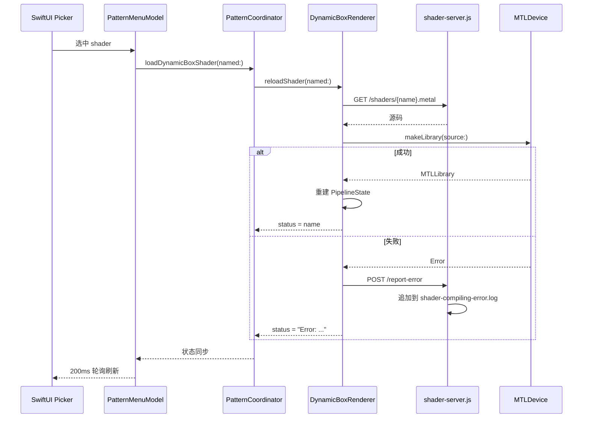

# DynamicBox — 动态着色器使用规范

## 目录结构

```
vr-dive/Demos/DynamicBox/
├── DynamicBoxRenderer.swift      # 渲染器（热加载逻辑）
├── DynamicBoxShaders.metal       # 内嵌默认着色器（编译进 app）
├── DynamicBoxTypes.swift         # Uniforms 结构体
├── shader-server.js              # Node.js 后端服务
├── shaders/                      # 可动态加载的 .metal 着色器
│   ├── default.metal             # 默认：三维网格光点
│   ├── waves.metal               # 示例：彩色波形干涉
│   └── sdf-shapes.metal          # 示例：复杂 SDF 几何体
├── server.log                    # 服务运行日志（已 gitignore）
└── shader-compiling-error.log    # Metal 编译错误日志（已 gitignore）
```

> **关键原则**：所有与 DynamicBox 相关的资源（着色器、服务脚本、日志）都放在本目录下，不扩散到顶层。

---

## 服务启停

### 启动

```bash
cd vr-dive/Demos/DynamicBox && node shader-server.js
```

后台启动（推荐）：

```bash
cd vr-dive/Demos/DynamicBox && nohup node shader-server.js > /dev/null 2>&1 &
```

### 停止

```bash
pkill -f "node shader-server.js"
```

或通过 PID：

```bash
kill <PID>
```

### 网络连接

在 visionOS 真机上运行时，app 需要通过局域网连接回 Mac 上的服务。需要修改 `PatternMenuModel` 中的 `shaderServerBaseURL` 为 Mac 的局域网 IP：

```swift
// PatternSelection.swift
static let shaderServerBaseURL = "http://192.168.x.x:8888"
```

同时在 `DynamicBoxRenderer.swift` 中修改同样的 IP：

```swift
private let serverBaseURL = "http://192.168.x.x:8888"
```

检查 Mac IP：

```bash
ipconfig getifaddr en0
```

---

## 日志规范

| 文件 | 用途 | 格式 |
|------|------|------|
| `server.log` | 服务运行日志（启动、请求摘要、错误摘要） | `[ISO时间] 消息` |
| `shader-compiling-error.log` | Metal 编译失败详情（由 visionOS app 通过 POST /report-error 上报） | `=== ISO时间 ===\n错误详情\n` |

两个日志文件均被 `.gitignore` 忽略（规则：`vr-dive/Demos/DynamicBox/*.log`）。

### 查看日志

```bash
# 实时跟踪服务日志
tail -f vr-dive/Demos/DynamicBox/server.log

# 查看最近编译错误
cat vr-dive/Demos/DynamicBox/shader-compiling-error.log
```

---

## 着色器编写规范

### 基本要求

每个 `.metal.txt` 文件必须包含一个名为 `dynamicBoxFragment` 的 fragment 函数，签名固定如下：

```metal
fragment float4 dynamicBoxFragment(
    DynamicBoxVertexOut        in         [[stage_in]],
    constant DynamicBoxUniforms &uniforms [[buffer(0)]],
    constant float4x4         *v2wMats    [[buffer(1)]],
    constant float4x4         *vpMatrices [[buffer(2)]])
```

### 自动注入的辅助代码

渲染器在编译前会自动将以下内容注入到着色器源码前面，**着色器文件内无需重复定义**：

- `#include <metal_stdlib>` + `using namespace metal;`
- `DynamicBoxUniforms` 结构体
- `DynamicBoxVertexOut` 结构体
- `DB_PI` 常量
- `DB_BOXDIMS` 常量（`float3(0.95, 0.95, 1.25)`）
- `db_boxHit()` 辅助函数（射线与 AABB 相交）

### 可用 Uniforms

```metal
struct DynamicBoxUniforms {
    float  time;              // 动画时间（秒）
    uint   viewCount;         // 立体视图数量
    float  boxScale;          // 盒子世界空间缩放
    float  _pad;              // 填充对齐
    float4 objectCenter;      // 盒子世界坐标中心
    float4x4 patternTransform; // 图案导航变换矩阵
};
```

### 编写步骤

1. 在 `shaders/` 目录下创建 `xxx.metal`
2. 编写 `dynamicBoxFragment` 函数（只需写 fragment 函数体 + 自定义辅助函数）
3. 重启服务或等待热加载（服务自动读取文件系统）
4. 在 visionOS 的 Picker 中选择 `xxx` 即可加载

### 示例结构

```metal
// 自定义辅助函数
static float3 myColor(float3 p, float t) { ... }

// Fragment 入口
fragment float4 dynamicBoxFragment(
    DynamicBoxVertexOut        in         [[stage_in]],
    constant DynamicBoxUniforms &uniforms [[buffer(0)]],
    constant float4x4         *v2wMats    [[buffer(1)]],
    constant float4x4         *vpMatrices [[buffer(2)]])
{
    // 1. 重建视线（参考 default.metal 中的标准流程）
    // 2. 计算场景颜色
    // 3. return float4(color, 1.0);
}
```

### 调试技巧

- 返回纯色测试管道是否正常工作：`return float4(1, 0, 0, 1);`
- 编译错误会自动通过 `POST /report-error` 上报到 `shader-compiling-error.log`
- 可在 `server.log` 中看到加载请求的记录

---

## 坐标系统

- 盒子在局部空间的范围：`[-0.95, 0.95]`（X/Y）、`[-1.25, 1.25]`（Z）
- 中心位于 `objectCenter`（世界坐标 `(0, -0.05, -1.1)`）
- 世界空间缩放由 `boxScale`（默认 `0.84`）控制
- 渲染器使用 `reverse-Z`（深度比较 `.greater`，近=1 远=0）

---

## 数据流


